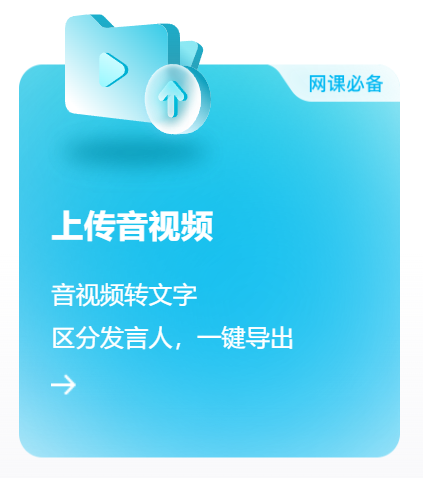
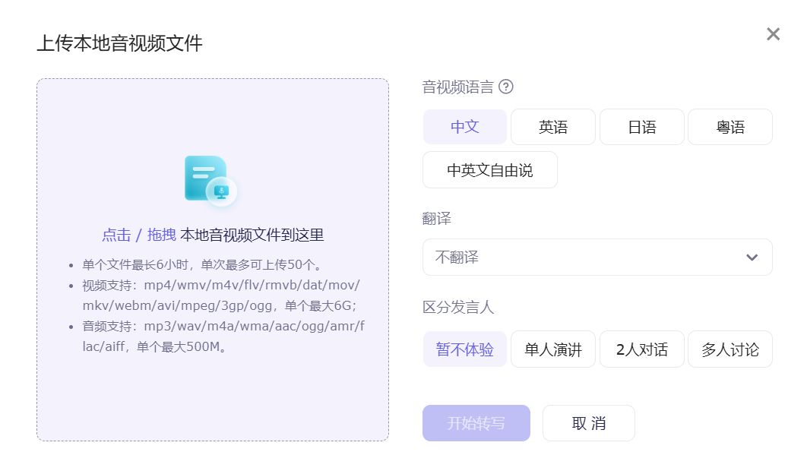
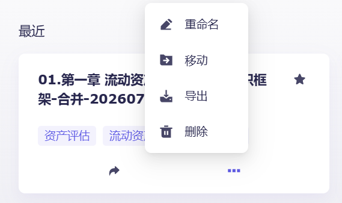
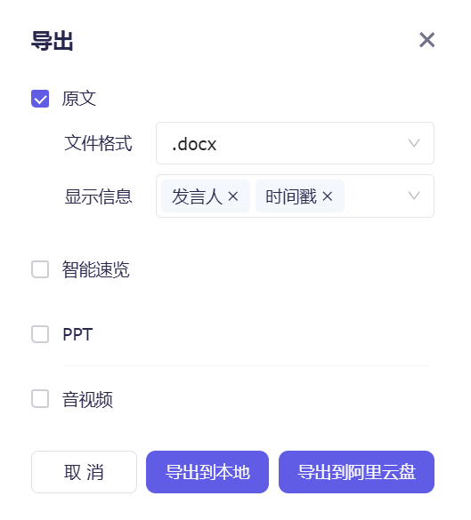
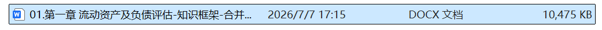
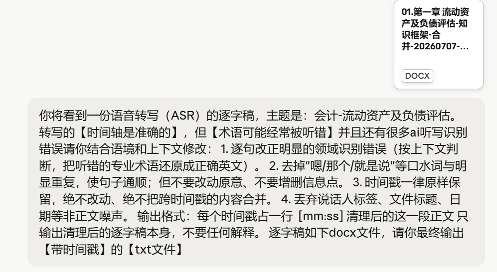
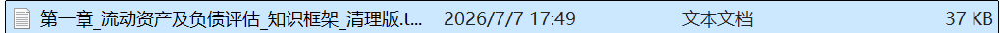
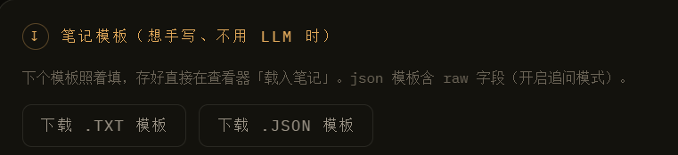
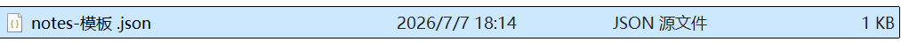
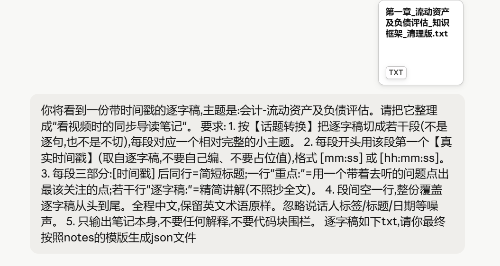

# 随影笔记 · 制作笔记教程

从一节网课视频，到一份能跟着视频走、还能追问 AI 的笔记，一共三步：

| 步骤 | 做什么 | 产出 |
| --- | --- | --- |
| [第一步](#第一步用通义听悟生成逐字稿) | 把视频转成带时间戳的逐字稿 | `逐字稿.docx` |
| [第二步](#第二步用-ai-清洗逐字稿) | 让 AI 纠错、去口水词 | `清理版.txt` |
| [第三步](#第三步用-ai-生成-json-导读笔记) | 让 AI 按模板整理成导读笔记 | `notes.json` |

最后把视频和 `notes.json` 一起载入随影笔记就行。

> **只想要纯笔记？** 第三步也可以生成 `.txt`（更省 token），但 `.txt` 不含原始逐字稿，**不能开启 AI 追问**。想要追问功能就必须用 `.json`。

---

## 第一步：用通义听悟生成逐字稿

目标：网课视频 → 带时间戳的逐字稿。

打开 <https://tingwu.aliyun.com/home>，找到「上传音视频」。



选择本地音视频并开始转写。



转写完成后，在文件卡片右下角点 `...` → **导出**。



导出设置里**务必勾选「时间戳」**——随影笔记全靠时间戳把笔记和视频对齐，没有时间戳后面两步都做不了。文件格式选 `.docx`，然后「导出到本地」。



得到逐字稿 `.docx` 文件。



---

## 第二步：用 AI 清洗逐字稿

语音转写的**时间轴是准的，但专业术语经常被听错**，还有很多口水词。这一步让 AI 把它修顺。

任选一个大语言模型（Gemini / ChatGPT / DeepSeek / Claude…），把**第一步的 docx** 和下面这段提示词一起发给它：

```text
你将看到一份语音转写（ASR）的逐字稿，主题是：_____。
转写的【时间轴是准确的】，但【术语可能经常被听错】并且还有很多 AI 听写识别错误，
请你结合语境和上下文修改：
1. 逐句改正明显的领域识别错误（按上下文判断，把听错的专业术语还原成正确英文）。
2. 去掉"嗯 / 那个 / 就是说"等口水词与明显重复，使句子通顺；
   但不要改动原意、不要增删信息点。
3. 时间戳一律原样保留，绝不改动、绝不把跨时间戳的内容合并。
4. 丢弃说话人标签、文件标题、日期等非正文噪声。

输出格式：每个时间戳占一行
[mm:ss] 清理后的这一段正文

只输出清理后的逐字稿本身，不要任何解释。
逐字稿如下 docx 文件，请你最终输出【带时间戳】的【txt 文件】
```

> 记得把 `主题是：_____` 填上，比如「会计 - 流动资产及负债评估」。主题给得越准，术语纠错越准。



模型会直接给你一个 txt 文件；如果它只是把结果打在对话里，自己复制粘贴存成 `.txt` 也一样。



> **也可以不出仓库**：随影笔记的「工作台」内置了「仅清理逐字稿」模式，填好 API key 后可以直接在本地跑完这一步。

---

## 第三步：用 AI 生成 JSON 导读笔记

先拿模板：打开随影笔记 → **工作台** → 拉到最下面 → **下载 .JSON 模板**。





然后把**两份文件**一起发给大语言模型：

1. 第二步的**清理版逐字稿 `.txt`**
2. 刚下载的 **`notes` 模板 `.json`**

> ⚠️ 两份都要传。模板决定了输出的 JSON 结构，漏传模板模型就会自己编字段名，随影笔记会读不出来。

配上这段提示词：

```text
你将看到一份带时间戳的逐字稿，主题是：________。
请把它整理成"看视频时的同步导读笔记"。

要求：
1. 按【话题转换】把逐字稿切成若干段（不是逐句，也不是不切），
   每段对应一个相对完整的小主题。
2. 每段开头用该段第一个【真实时间戳】（取自逐字稿，不要自己编、不要占位值），
   格式 [mm:ss] 或 [hh:mm:ss]。
3. 每段三部分：
   [时间戳] 后同行 = 简短标题；
   一行"重点：" = 用一个带着去听的问题点出最该关注的点；
   若干行"逐字稿：" = 精简讲解（不照抄全文，公式用纯文本如 P(A|B)=P(A∩B)/P(B)）。
4. 段间空一行，整份覆盖逐字稿从头到尾。全程中文，保留英文术语原样。
   忽略说话人标签 / 标题 / 日期等噪声。
5. 只输出笔记本身，不要任何解释，不要代码块围栏。

逐字稿如下 txt，请你最终按照 notes 的模版生成 json 文件
```



拿到 `notes.json` 后，回到随影笔记：**载入视频** → **载入笔记**，笔记就会跟着播放进度自动切换了。

---

## 检查一下做对了没有

载入笔记后：

- 右下角状态条写着**「（追问模式）」** — 说明 JSON 读成功了，可以追问。
  写着「（纯笔记）」说明当前是 txt，或者 JSON 结构没被识别。
- 目录里每一段右边会出现一个小小的**「问」**字。
- 当前段落卡片下方有**「✦ 就这段问 AI」**按钮。

三个都在，就可以开始追问了（追问还需要在工作台填好 API key）。

---

## 常见问题

**载入 JSON 后显示「纯笔记」、没有「问」字。**
多半是模型在文件开头加了 ` ```json ` 之类的代码块围栏。用记事本打开，确保文件**第一个字符是 `{`**，最后一个是 `}`，删掉多余的围栏和说明文字。另外确认顶层有 `segments` 数组。

**笔记和视频对不上。**
检查时间戳是不是模型自己编的。第二步的提示词特意强调「时间轴准确、原样保留」，如果模型没听话，重跑一次并明确要求「时间戳必须逐字取自原文」。

**填了 API key，追问还是打不开。**
点右上角的**「自检」**按钮，它会把当前状态汇总成一份报告并复制到剪贴板，一眼能看出是哪一项没配好。最常见的原因是：清理 / 生成 / 问答三处可以各自选不同预设，而问答选中的那个预设是空的——用问答面板里的「预设」下拉切到填好的那个即可。

**Mac 上填的 key 一刷新就没了。**
Safari 直接双击打开本地 HTML 时会禁用 `localStorage`。改用 Chrome / Edge 的**普通窗口**（不要用无痕模式）打开即可。

---

原始 Word 版教程：[随影笔记使用教程.docx](随影笔记使用教程.docx)
